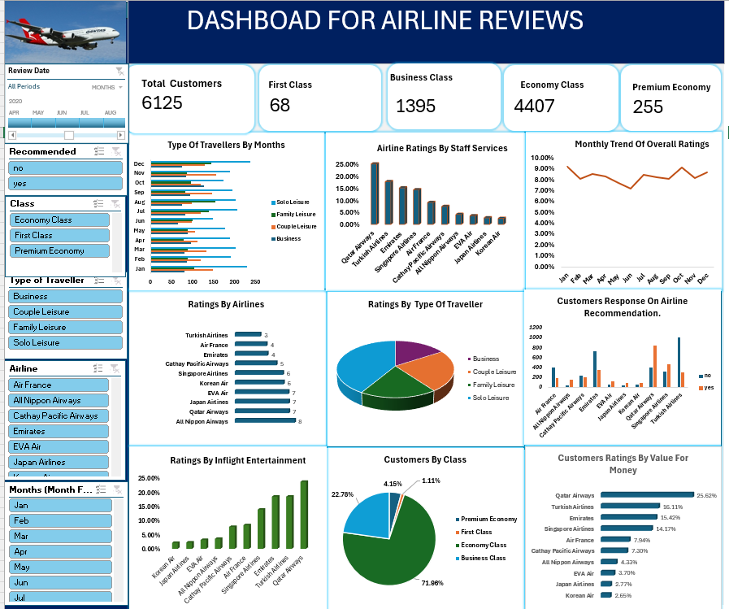
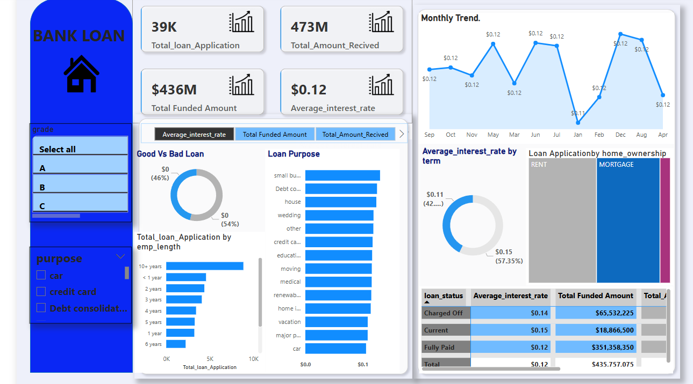

# Project 1

**Title:** [Customer experience Insights For Airlines](https://github.com/Adorablesally/github.io/blob/main/Airline%20Review%20Project.xlsm)

**Tools Used:** Microsoft Excel (Pivot Table, Pivot chart, Conditional Formating, Slicers,Timelines)

**Project Description:**This project involved analysing customer reviews from various airlines to determine overall passenger experience. It is designed to provide a comprehensive overview of key performance metrics. This dashboard allows stakeholders to easily monitor and analyze the company’s performance across different routes, based on the type of Airline, flight class, type of travellers as well as the review date of the customers. The dashboard includes the following features:
Type of travellers on Monthly basis: This detailed comprehensively the type of travellers we have on monthly basis whether Solo travcellers, couples or those that travel for business purposes.
Airline ratings by staff services: This gives an insight into travellers rate the airline staffs based on their own customer service experience.
Monthly trend of overall ratings: This enables close monitoring of travellers ratings whether there is an increase or decrease compared to the previous months.
Ratings by Airlines: Highlights the Airline that has the best ratings than the other based on the overall ratings from their customers.
Ratings By type of Travellers: This visualises the type of traveller that gives the overall best ratings across all the rating metrics
Additionally, the dashboard includes interactive slicers and timeline for:
Month: Filter the data to view performance for a specific month or range of months.
Routes: Focus on Airline routes and the preferred airline routes by customers.

**Key findings:**
Ratings By value for money: Travelers who pay more expect more: better seating, food, entertainment, and customer service.
The services received do not match the price paid, which makes the premium customers to feel disappointed.
Ratings by Seat Comfortability : Some of the customers gave poor ratings because of lack of comfortable seating. Long flights without comfortable seatings make them cramped, poorly cushioned seats can lead to fatigue, or back pain.

**Dashboard Overview:**

# Project 2

**Title:**
employee data interrogation and manipulation

**SQL Code:**
[employee SQL code](https://github.com/Adorablesally/github.io/commit/4f8b6d02fc34e49018a5de5a8e912fd57ae41556)

**SQL Skills Used:**
Data Retrieval (SELECT): Queried and extracted specific information from the database.
Data Aggregation (SUM, COUNT): Calculated totals, such as sales and quantities, and counted records to analyze data trends.
Data Filtering (WHERE, BETWEEN, IN, AND): Applied filters to select relevant data, including filtering by ranges and lists.
Data Source Specification (FROM): Specified the tables used as data sources for retrieval
 

**Project Description:**
This project focuses on the analysis of a comprehensive dataset containing detailed information about approximately 11,000 football players. The primary objective is to utilize SQL for extracting meaningful insights regarding player demographics, performance metrics, and other relevant attributes.
Database Design and Implementation: Develop a relational database schema to effectively store and manage the football players' data, ensuring normalization and referential integrity.
Data Analysis Using SQL: Execute SQL queries to analyze various aspects of the dataset, including: Player demographics (e.g., age, nationality). Performance metrics (e.g., ratings, positions). Financial attributes (e.g., wages, market value).
Insight Extraction: Identify patterns and trends within the data, such as: Nationalities with the highest representation among players. Correlation between player attributes and performance metrics. Distribution of players across different clubs and leagues.
Reporting and Visualization: Present the findings through comprehensive reports and visualizations to facilitate better understanding and decision-making. By the end of this project, we aim to have a fully functional SQL database capable of providing in-depth analysis of football players' data, offering valuable insights for stakeholders such as team managers, scouts, and analysts
 
**Technology used:**
SQL server

# Project 3

**Title:**[Dashboard for Bank Loan Application.](https://github.com/Adorablesally/github.io/blob/main/loan.png)

**Tools Used:** POWERBI,DAX,Slicers,Line Chart,Cards,Stacked Bar Chart,Stacked Column Chart,Pie Chart and Table.

**Project Description:** The project involves analyzing a dataset of loan applications to assess lending performance and borrower characteristics. It includes aggregating key financial metrics, comparing loan statuses, and uncovering trends based on factors such as employment length, loan purpose, and loan terms. Visual dashboards and statistical summaries will be generated to support data-driven decision-making.
Loan Purpose: This detailed different reasons why loans may be requested from Banks ranging from Education, Car Finace,Mortgages,small business,weddings,vacation..e.t.c
Total Loan Application by Employee length: This comprises of the duration or total time spent by the employee within the bank. This involves grouping applications by years of employment.e.g., <1 year, 1–3 years, 5–10 years, etc It assesses whether employment stability correlates with loan approvals or funding amounts.

**Key findings:** 
Loan Purpose: Majority of people who requested for loans are those who run small businesses, debt consolidation purpose and also for housing purpose.
Total loan application by employee lenght: The employees that has the higest number of loan applications are those who has spent more than 10 years in the bank.
Average interest rate: The longer it takes an employeed to repay their loan, the longer the interest rate. The loan that is tagged as good loan has an an average interest rate of 0.12 while the loan that is tagged as bad loan has an averafe interest rate of 0.14.

**Dashboard Overview:**

