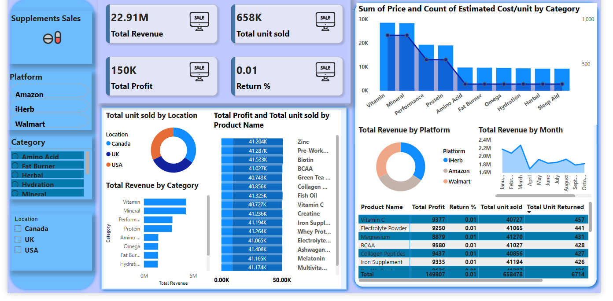
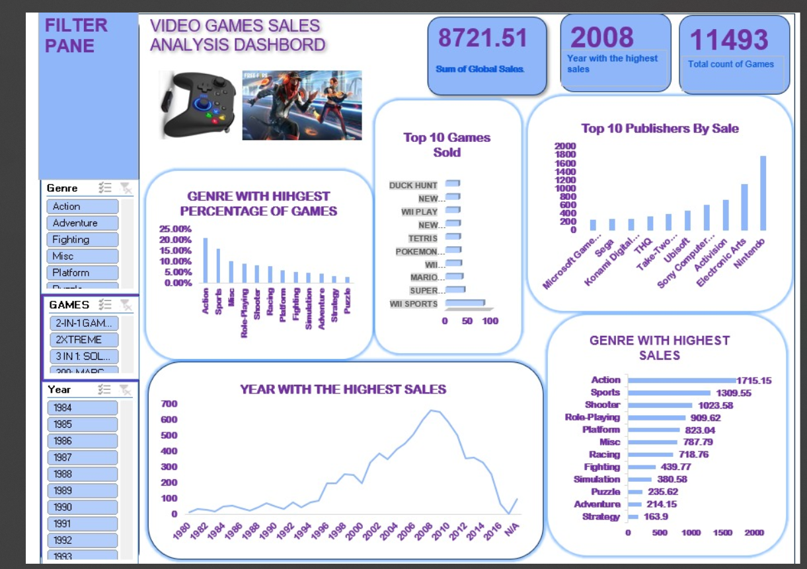

# Project 1

**Title:** [Customer experience Insights For Airlines](https://github.com/Adorablesally/github.io/blob/main/Airline%20Review%20Project.xlsm)

**Tools Used:** Microsoft Excel (Pivot Table, Pivot chart, Conditional Formating, Slicers,Timelines)

**Project Description:**This project involves analysing customer reviews from various airlines to determine overall passenger experience. It is designed to provide a comprehensive overview of key performance metrics. This dashboard allows stakeholders to easily monitor and analyze the company’s performance across different routes, based on the type of Airline, flight class, type of travellers as well as the review date of the customers. The dashboard includes the following features:
Type of travellers on Monthly basis: This detailed comprehensively the type of travellers we have on monthly basis whether Solo travcellers, couples or those that travel for business purposes.
Airline ratings by staff services: This gives an insight into travellers rate the airline staffs based on their own customer service experience.
Monthly trend of overall ratings: This enables close monitoring of travellers ratings whether there is an increase or decrease compared to the previous months.
Ratings by Airlines: Highlights the Airline that has the best ratings than the other based on the overall ratings from their customers.
Ratings By type of Travellers: This visualises the type of traveller that gives the overall best ratings across all the rating metrics
Additionally, the dashboard includes interactive slicers and timeline for:
Month: Filter the data to view performance for a specific month or range of months.
Routes: Focus on Airline routes and the preferred airline routes by customers.

**Key findings:**
Ratings By value for money: Travelers who pay more expect more: better seating, food, entertainment, and customer service.
The services received do not match the price paid, which makes the premium customers to feel disappointed.
Ratings by Seat Comfortability : Some of the customers gave poor ratings because of lack of comfortable seating. Long flights without comfortable seatings make them cramped, poorly cushioned seats can lead to fatigue, or back pain.

**Dashboard Overview:**

# Project 2

**Title:**
employee data interrogation and manipulation

**SQL Code:**
[employee SQL code](https://github.com/Adorablesally/github.io/commit/4f8b6d02fc34e49018a5de5a8e912fd57ae41556)

**SQL Skills Used:**
Data Retrieval (SELECT): Queried and extracted specific information from the database.
Data Aggregation (SUM, COUNT): Calculated totals, such as sales and quantities, and counted records to analyze data trends.
Data Filtering (WHERE, BETWEEN, IN, AND): Applied filters to select relevant data, including filtering by ranges and lists.

**Data Source Specification (FROM):**
[Football data](https://github.com/Adorablesally/github.io/blob/main/Football%20Players%20Data.xlsx)
 

**Project Description:**
This project focuses on the analysis of a comprehensive dataset containing detailed information about approximately 11,000 football players. The primary objective is to utilize SQL for extracting meaningful insights regarding player demographics, performance metrics, and other relevant attributes.
Database Design and Implementation: Develop a relational database schema to effectively store and manage the football players' data, ensuring normalization and referential integrity.
Data Analysis Using SQL: Execute SQL queries to analyze various aspects of the dataset, including: Player demographics (e.g., age, nationality). Performance metrics (e.g., ratings, positions). Financial attributes (e.g., wages, market value).
Insight Extraction: Identify patterns and trends within the data, such as: Nationalities with the highest representation among players. Correlation between player attributes and performance metrics. Distribution of players across different clubs and leagues.
Reporting and Visualization: Present the findings through comprehensive reports and visualizations to facilitate better understanding and decision-making. By the end of this project, we aim to have a fully functional SQL database capable of providing in-depth analysis of football players' data, offering valuable insights for stakeholders such as team managers, scouts, and analysts
 
**Technology used:**
SQL server

# Project 3

**Title:**[Dashboard for Bank Loan Application.](https://github.com/Adorablesally/github.io/blob/main/loan.png)

**Tools Used:** POWERBI,DAX,Slicers,Line Chart,Cards,Stacked Bar Chart,Stacked Column Chart,Pie Chart and Table.

**Project Description:** The project involves analyzing a dataset of loan applications to assess lending performance and borrower characteristics. It includes aggregating key financial metrics, comparing loan statuses, and uncovering trends based on factors such as employment length, loan purpose, and loan terms. Visual dashboards and statistical summaries will be generated to support data-driven decision-making.
Loan Purpose: This detailed different reasons why loans may be requested from Banks ranging from Education, Car Finace,Mortgages,small business,weddings,vacation..e.t.c
Total Loan Application by Employee length: This comprises of the duration or total time spent by the employee within the bank. This involves grouping applications by years of employment.e.g., <1 year, 1–3 years, 5–10 years, etc It assesses whether employment stability correlates with loan approvals or funding amounts.

**Key findings:** 
Loan Purpose: Majority of people who requested for loans are those who run small businesses, those for debt consolidation purpose and also for housing purpose.
Total loan application by employee lenght: The employees that has the higest number of loan applications are those who has spent more than 10 years in the bank.
Average interest rate: The longer it takes an employee to repay their loan, the longer the interest rate. The loan that is tagged as good loan has an an average interest rate of 0.12 while the loan that is tagged as bad loan has an average interest rate of 0.14.

**Dashboard Overview:**

# Project 4

**Title:** [Supplements Sales Insight](https://github.com/Adorablesally/github.io/blob/main/Supplements%20powerbi.pbix)

**Tools Used:**POWERBI,DAX,Slicers,Cards,Tables,Metrix,Charts,e.t.c.

**Project Description:** supplements sales analysis involves analyzing and interpreting data related various supplements categories such as  dietry, health, and fitness supplements. This includes vitamins, protein powders, amino acid,herbal products, hydration, performance enhancers, omega,sleep aid, and other wellness-related goods. The goal is to understand customer behavior, product performance, market trends, and sales instigators to inform strategic business decisions. Total Units Sold by Location: This compares the sales made by each region and total units of products sold  by this regions which include UK, USA, and CANADA.
Total Revenue by Platform: The platforms of sales include Iherb,Amazon and Walmart. This helps to compare the sales platform that generated the most revenue for the supplements sales.

**Key findings:** Key findings:
Regional Profitability: Identified the most profitable countries and highlighted regions where performance could be improved.
Seasonal Trends: Revealed patterns in sales and profit that correspond with seasonal events, allowing for more strategic planning.
Top-Performing Products: Highlighted which supplement category are driving the most revenue and profit, aiding in inventory and marketing decisions.
Sales Volatility: Analyzed monthly sales fluctuations to understand market dynamics and adjust business strategies accordingly.
This dashboard serves as a crucial tool for the Supplement sales management team, providing clear, actionable insights that drive informed decision-making and strategic planning.

**Dashboard Overview:**

 # Project 5
 
**Title:** [Video Games Sales Insight](https://github.com/Adorablesally/github.io/blob/main/Video_games_sales.xlsx)

**Tools Used:** Microsoft Excel,Pivot table,Pivot chart,Conditional formating,slicer,line charts,bar chart,column chart,pie chart

**Project Description:** This is a comprehensive video game analysis insight which span across all genres to uncover gameplay trends and players' preferences. It begins by categorizing core genres such as Action, Role_playing, Adventure, Simulation, Racing, Puzzle, Sports, and more—highlighting their defining mechanics and top title. Player engagement is assessed through retention, community involvement, and streaming or e-sports presence. The insight also examines cultural impact, regional preferences, and representation across games. The analysis is focused on finding answers to the following  questions from the Stakeholders. 1.Genre with the highest percentage of games. 2.Genre with the highest sales. 3. Top 10 publishers by sales. 4.Top 10 games sold. 5.What year had the highest sales and suggest why it happened.

**Key findings:** 
According to the analysis of the game, in 2008, it was found that there was a significant increase in video game sales, marking one of the industry's strongest year. This growth was driven by the widespread popularity of consoles like the Xbox 360, PlayStation 3, and Nintendo Wii. The Wii, in particular, expanded the gaming audience by attracting casual and family-oriented players. Blockbuster titles such as Grand Theft Auto IV, Mario Kart Wii, and Call of Duty: World at War contributed heavily to high sales figures. Additionally, the rise of digital distribution platforms and downloadable content (DLC) began reshaping consumer buying habits. The increased variety in game genres and platforms, coupled with improved accessibility and innovative gameplay experiences, played a major role in boosting overall game sales during the year.

**Dashboard Overview:** 

 # Project 6
 
 **Title:**  Football Players data interrogation and manipulation

**SQL Code:** [Football data SQL Code](https://github.com/Adorablesally/github.io/commit/2595a75a52ba764a26aefdff46cd9d26acf7e402)

**SQL Skills Used:**
Data Retrieval (SELECT): Queried and extracted specific information from the database.
Data Aggregation (SUM, COUNT): Calculated totals, such as sales and quantities, and counted records to analyze data trends.
Data Filtering (WHERE, BETWEEN, IN, AND): Applied filters to select relevant data, including filtering by ranges and lists.

**Project Description:** 
This project focuses on the analysis of a comprehensive dataset containing detailed information OF 307 football players. The primary objective is to utilize SQL for extracting meaningful insights regarding player demographics, performance metrics, and other relevant attributes.
Database Design and Implementation: Develop a relational database schema to effectively store and manage the football players' data, ensuring normalization and referential integrity.
Data Analysis Using SQL: Execute SQL queries to analyze various aspects of the dataset, including: Player demographics (e.g., age, nationality). Performance metrics (e.g., ratings, positions). Financial attributes (e.g., wages, market value).
Insight Extraction: Identify patterns and trends within the data, such as: Nationalities with the highest representation among players. Correlation between player attributes and performance metrics. Distribution of players across different clubs and leagues.
Reporting and Visualization: Present the findings through comprehensive reports and visualizations to facilitate better understanding and decision-making. By the end of this project, we aim to have a fully functional SQL database capable of providing in-depth analysis of football players' data, offering valuable insights for stakeholders such as team managers, scouts, and analysts.

 **Data Source Specification (FROM):**
 [Football data for SQL](https://github.com/Adorablesally/github.io/blob/main/Football%20Players%20Data.xlsx)
 
**Technology used: **
SQL server

